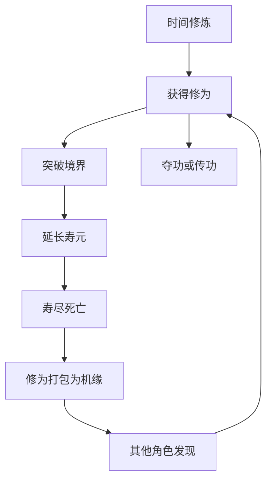

# 游戏规则草案 v0.1

## 一、游戏定位

这是一个运行在二维无限坐标世界中的多人策略游戏。

系统只提供最基础的自然规则：

* 时间产生修为，同时消耗寿元。
* 修为决定境界。
* 境界决定寿元上限、神识范围和移动速度。
* 角色可以交谈、传功、夺功。
* 死亡修为会转化为随机机缘。
* 角色可以通过 MCP 将角色交给 AI 操作。

系统不提供宗门、联盟、师徒、交易市场等组织功能。这些制度由角色自行约定、开发和维护。

---

# 二、世界空间

## 2.1 XY坐标

整个世界建立在二维坐标系中：

```text
位置 = (x, y)
```

角色、机缘都具有真实坐标。

角色只能通过持续移动改变位置，不能直接瞬移；死亡后的转世除外。

## 2.2 已探索世界范围

系统记录所有角色曾经到达过的坐标极值：

```text
minX：历史到达过的最小X
maxX：历史到达过的最大X
minY：历史到达过的最小Y
maxY：历史到达过的最大Y
```

由此形成当前世界随机范围：

[
x\in[minX,maxX]
]

[
y\in[minY,maxY]
]

机缘投放和系统随机转世均使用这个范围。

角色持续向外探索，就会不断扩大世界边界。

---

# 三、角色基础属性

每个角色拥有以下核心状态：

```json
{
  "role_id": "role_1001",
  "name": "青玄",
  "life_number": 1,
  "position": {
    "x": 1200,
    "y": -850
  },
  "cultivation": 5.2,
  "realm": 3,
  "realm_name": "炼气后期",
  "age": 0.087,
  "max_lifespan": 2,
  "sense_radius": 25,
  "move_speed": 5,
  "status": "alive"
}
```

核心属性包括：

* 角色名
* 世数（当前是第几世）
* 修为
* 境界
* 年龄
* 寿元上限
* 神识范围
* 移动速度
* XY坐标
* 当前状态

## 3.1 世数

系统使用`life_number`记录角色当前是第几世。

* 新角色首次进入世界时为第1世，`life_number = 1`。
* 角色死亡并进入待转世状态时，世数保持不变。
* 角色成功完成转世、重新进入世界时，世数增加1。
* 世数没有上限，不会因修为、境界或转世方式而重置。
* 角色的`role_id`在不同世之间保持不变。
* `life_number`属于角色私有信息，只向角色自己显示，不会通过神识扫描或其他角色查询接口公开。

## 3.2 角色名

角色创建角色时必须提供角色名。未提供角色名时，角色创建失败。

角色名遵循以下规则：

* 所有角色的名称在整个世界中不可重复。
* 角色名创建成功后不可修改。
* 角色死亡、待转世或完成转世后，角色名保持不变。
* 死亡和转世不会释放角色名，其他角色不能使用该名称。
* `role_id`是系统内部永久身份，角色名是对外展示的永久名称。

如果提交的角色名已被使用，系统拒绝创建角色。

## 3.3 账号与MCP授权

游戏开放注册，任何人都可以创建账号和角色，不需要邀请码或人工审批。每次注册必须同时提交账号、密码和未被使用的角色名。

一个账号和密码只对应一个角色，账号与角色建立永久一对一关系：

```text
一个账号 = 一个角色
```

账号不能在多个角色之间切换。需要创建其他角色时，必须使用另一个独立账号。

系统允许同一人注册多个独立账号，但每个账号、角色和API Key分别接受注册限流、登录保护和工具调用限流。

系统为角色提供独立的API Key，供MCP代理调用游戏工具：

* Web前端使用账号和密码登录。
* MCP代理使用API Key鉴权，不使用角色的登录密码。
* 每个API Key只允许操作其绑定的角色。
* Web前端与已授权的MCP代理可以同时控制同一个角色。
* 两个入口提交的命令进入同一套权威结算流程。

---

# 四、时间、修为与年龄

## 4.1 时间修炼

角色不通过任务、打怪、装备或功法获得基础修为。

修为只会随时间自然增长。所有存活角色的基础修炼速度固定为每分钟1点修为，即每秒获得六十分之一点修为：

[
修为增长=经过的存活秒数\div60
]

例如：

```text
转世进入世界时：0修为
1分钟后：1修为
10分钟后：10修为
1小时后：60修为
```

境界不会提高自然修炼速度。死亡和待转世期间不产生自然修为。

## 4.2 年龄增长

角色获得修为的同时，年龄也同步增长：

[
年龄增长=经过的自然时间
]

因此时间同时具有两种作用：

> 时间增加修为，也消耗寿元。

## 4.3 境界

境界由当前修为自动计算，不是独立经验值。

系统使用0至31的层级编号登记境界。层级编号用于境界比较、接口传输和状态存储，境界名称用于展示。

每个层级具有固定的移动速度和神识半径：

[
神识半径=(移动速度)^2
]

| 层级 | 境界 | 移动速度/秒 | 神识半径 |
| -: | ---- | --------: | ------------: |
| 0 | 凡人 | 1 | (1^2) |
| 1 | 炼气初期 | 2 | (2^2) |
| 2 | 炼气中期 | 3 | (3^2) |
| 3 | 炼气后期 | 5 | (5^2) |
| 4 | 筑基初期 | 8 | (8^2) |
| 5 | 筑基中期 | 13 | (13^2) |
| 6 | 筑基后期 | 21 | (21^2) |
| 7 | 金丹初期 | 34 | (34^2) |
| 8 | 金丹中期 | 55 | (55^2) |
| 9 | 金丹后期 | 89 | (89^2) |
| 10 | 元婴初期 | 144 | (144^2) |
| 11 | 元婴中期 | 233 | (233^2) |
| 12 | 元婴后期 | 377 | (377^2) |
| 13 | 化神初期 | 610 | (610^2) |
| 14 | 化神中期 | 987 | (987^2) |
| 15 | 化神后期 | 1,597 | (1,597^2) |
| 16 | 合体初期 | 2,584 | (2,584^2) |
| 17 | 合体中期 | 4,181 | (4,181^2) |
| 18 | 合体后期 | 6,765 | (6,765^2) |
| 19 | 大乘初期 | 10,946 | (10,946^2) |
| 20 | 大乘中期 | 17,711 | (17,711^2) |
| 21 | 大乘后期 | 28,657 | (28,657^2) |
| 22 | 渡劫期 | 46,368 | (46,368^2) |
| 23 | 人仙 | 75,025 | (75,025^2) |
| 24 | 天仙 | 121,393 | (121,393^2) |
| 25 | 金仙 | 196,418 | (196,418^2) |
| 26 | 大罗金仙 | 317,811 | (317,811^2) |
| 27 | 九天玄仙 | 514,229 | (514,229^2) |
| 28 | 罗天上仙 | 832,040 | (832,040^2) |
| 29 | 仙君 | 1,346,269 | (1,346,269^2) |
| 30 | 仙帝 | 2,178,309 | (2,178,309^2) |
| 31 | 仙尊 | 3,524,578 | (3,524,578^2) |

角色修为达到门槛后自动突破；修为低于门槛后自动跌境。

## 4.4 修为门槛与寿元登记表

自然修炼时间表示角色从0修为开始，按照每分钟1点修为累计到对应门槛所需的总时间，不是从上一境界开始计算的单阶段时间。

| 境界 | 所需修为 | 自然修炼时间 | 寿元上限 |
| ---- | --------: | -----------: | ------: |
| 凡人 | 0 | 0分钟 | 1小时 |
| 炼气初期 | 2 | 2分钟 | 2小时 |
| 炼气中期 | 3 | 3分钟 | 2小时 |
| 炼气后期 | 5 | 5分钟 | 2小时 |
| 筑基初期 | 8 | 8分钟 | 3小时 |
| 筑基中期 | 13 | 13分钟 | 3小时 |
| 筑基后期 | 21 | 21分钟 | 3小时 |
| 金丹初期 | 34 | 34分钟 | 5小时 |
| 金丹中期 | 55 | 55分钟 | 5小时 |
| 金丹后期 | 89 | 1小时29分钟 | 5小时 |
| 元婴初期 | 144 | 2小时24分钟 | 8小时 |
| 元婴中期 | 233 | 3小时53分钟 | 8小时 |
| 元婴后期 | 377 | 6小时17分钟 | 8小时 |
| 化神初期 | 610 | 10小时10分钟 | 13小时 |
| 化神中期 | 987 | 16小时27分钟 | 13小时 |
| 化神后期 | 1,597 | 26小时37分钟 | 13小时 |
| 合体初期 | 2,584 | 43小时4分钟 | 21小时 |
| 合体中期 | 4,181 | 69小时41分钟 | 21小时 |
| 合体后期 | 6,765 | 112小时45分钟 | 21小时 |
| 大乘初期 | 10,946 | 182小时26分钟 | 34小时 |
| 大乘中期 | 17,711 | 295小时11分钟 | 34小时 |
| 大乘后期 | 28,657 | 477小时37分钟 | 34小时 |
| 渡劫期 | 46,368 | 772小时48分钟 | 55小时 |
| 人仙 | 75,025 | 1,250小时25分钟 | 89小时 |
| 天仙 | 121,393 | 2,023小时13分钟 | 144小时 |
| 金仙 | 196,418 | 3,273小时38分钟 | 233小时 |
| 大罗金仙 | 317,811 | 5,296小时51分钟 | 377小时 |
| 九天玄仙 | 514,229 | 8,570小时29分钟 | 610小时 |
| 罗天上仙 | 832,040 | 13,867小时20分钟 | 987小时 |
| 仙君 | 1,346,269 | 22,437小时49分钟 | 1,597小时 |
| 仙帝 | 2,178,309 | 36,305小时9分钟 | 2,584小时 |
| 仙尊 | 3,524,578 | 58,742小时58分钟 | 4,181小时 |

该表不保证角色能够完全依靠自然修炼突破所有境界。按照当前数值，角色自然修炼可以到达元婴后期，但无法在8小时寿元内自然达到化神初期；缺少的修为必须通过传功、机缘或夺功获得。

---

# 五、寿元

## 5.1 境界寿元

每个境界拥有不同的寿元上限。

突破后：

* 境界提高。
* 寿元上限提高。
* 当前年龄不会归零。
* 神识范围和移动速度立即更新。

例如：

```text
当前年龄：2小时50分钟
筑基寿元：3小时

突破金丹后：
当前年龄仍为2小时50分钟
寿元上限提高至5小时
```

## 5.2 自然寿尽

当角色当前年龄达到所在境界的寿元上限时，角色死亡：

[
当前年龄\geq当前境界寿元上限
\Rightarrow 死亡
]

## 5.3 传功跌境限制

传功会降低角色修为，并可能导致境界下降。

系统必须在传功执行前计算传功者预计跌落的境界和对应寿元上限。

如果跌境后的寿元上限低于角色当前年龄，本次传功无效，双方修为都不会发生变化：

[
跌境后寿元上限<当前年龄
\Rightarrow 拒绝传功
]

例如：

```text
角色年龄：4小时
原境界：金丹，寿元5小时

预计传功后跌落筑基：
筑基寿元：3小时

4 > 3
→ 拒绝传功，角色仍为金丹
```

如果跌境后的寿元上限恰好等于角色当前年龄，传功可以执行，但传功者会在结算后因达到寿元上限而死亡：

```text
角色年龄：3小时
预计传功后跌落筑基
筑基寿元：3小时

3 = 3
→ 传功成功
→ 传功者寿尽死亡
```

---

# 六、神识

## 6.1 神识范围

不同境界拥有不同的神识范围，具体数值按照境界数值登记表计算。

神识半径固定为当前境界移动速度的平方。境界变化后，神识半径立即更新。

角色只能通过神识发现范围内的其他角色：

[
两人距离\leq神识范围
\Rightarrow 可以扫描到目标
]

当高境界角色扫描到低境界角色时，扫描结果包含：

* 目标的精准XY坐标。
* 目标境界。
* 目标生命状态。

扫描不会公开目标的准确修为。

神识扫描是角色在单一权威时刻获得的一次离散快照，不是持续雷达。同一角色通过 Web 与 MCP 共用扫描节奏，距离上一次成功神识扫描不足1秒时请求失败；达到或超过1秒后可以再次扫描。

官方 Web 客户端在存活角色页面保持活跃可见时，会在每次成功扫描5秒后自动进行下一次神识扫描。MCP代理是否自动扫描由代理自行决定，但仍受每角色最快1秒一次和工具调用预算约束。

## 6.2 高境界扫描与反向感应

设高境界角色A扫描到低境界角色B，并且：

[
A层级>B层级
]

[
A与B的距离\leq A的神识半径
]

扫描完成后：

* A立即获得B当前的精准XY坐标。
* B立即知道自己已被A扫描。
* B立即获得扫描来源相对于自己的精准方向。
* 精准方向只表示A所在方位，不提供A与B之间的准确距离。

如果A仍在B的神识范围之外：

[
A与B的距离>B的神识半径
]

B不能识别A的精准XY坐标，只能根据扫描来源的精准方向判断A所在方位。

只有当A进入B的神识范围后：

[
A与B的距离\leq B的神识半径
]

B才能通过自己的神识识别A当前的精准XY坐标。

这意味着扫描不是完全隐蔽的：

> 高境界角色可以在远处精确定位低境界角色，但低境界角色会立即知道自己被扫描以及扫描者所在的精确方向；只有双方进入低境界角色的神识范围后，低境界角色才能反向获得扫描者的精准位置。

## 6.3 感应到机缘

角色的神识与范围内的机缘建立联系时，系统使用固定文案：**感应到机缘**。

每份机缘拥有自己的感应范围，该范围由机缘等级决定，并与该机缘等级所对应的范围相同。

设角色神识半径为(R_p)，机缘感应半径为(R_o)。只要角色的神识范围与机缘感应范围发生接触或重叠，就能感应到机缘：

[
角色与机缘中心的距离\leq R_p+R_o
\Rightarrow 触发“感应到机缘”
]

因此，机缘中心不必进入角色神识范围；角色神识的边缘只要碰触到机缘感应范围的边缘，就会触发“感应到机缘”。

神识扫描只会告知角色双方范围已经接触并存在机缘，不会公开：

* 机缘的精准XY坐标。
* 机缘等级。
* 机缘感应半径。
* 机缘包含的总修为。
* 机缘当前剩余修为。
* 生成机缘的死亡角色身份。

角色必须继续寻找机缘的精准XY坐标；仅仅触发“感应到机缘”不能获得其中修为。

---

# 七、移动

## 7.1 坐标移动

角色可以指定目标坐标：

```text
move_to(x, y)
```

角色按照当前境界对应的速度持续移动，不能瞬间到达。

## 7.2 境界速度

不同境界拥有固定的移动速度，具体数值按照境界数值登记表执行，单位为坐标/秒。

境界越高，移动速度越快。角色突破或跌境后，移动速度立即更新；正在移动时，剩余路程按照更新后的速度继续计算。

## 7.3 四向持续移动

角色也可以选择上、下、左、右进行没有目标点的持续移动：

```text
上 = +Y
下 = -Y
左 = -X
右 = +X
```

方向移动必须设置正整数行进速度，启动时不能超过当前境界移动速度。移动期间的实际行进速度取设定行进速度和当前境界移动速度中的较小值。跌境会立即降低实际速度；之后境界速度恢复时，实际速度最多恢复到原设定值。

方向移动持续到角色停止、改向、改速、提交目标坐标移动、死亡或转世。方向移动没有目标点，不产生抵达事件。

---

# 八、交谈

## 8.1 发起交谈

角色只可以向自己当前神识范围内的目标发送交谈请求：

[
双方距离\leq发起者的神识半径
\Rightarrow 可以发起交谈
]

如果目标位于发起者的神识范围之外，`request_conversation`请求立即失败：

[
双方距离>发起者的神识半径
\Rightarrow 不可发起交谈
]

即使角色已经感应到自己被远处的高境界角色扫描，并知道扫描来源的精准方向，也不能向神识范围外的扫描者发起交谈请求。

发起交谈不限制双方境界，高境界、低境界和同境界角色都可以向神识范围内的目标发起请求：

```text
request_conversation(target_id)
```

收到请求的角色可以：

* 接受
* 拒绝
* 不作回应
* 在交谈过程中随时结束交谈

## 8.2 交谈不提供安全保护

交谈期间世界继续正常运行：

* 双方仍然可以移动。
* 双方年龄继续增长。
* 可以继续扫描。
* 可以传功。
* 高境界角色仍然可以接近并夺取低境界角色的修为。

交谈不会暂停游戏，也不会形成系统保护。

角色可以通过交谈：

* 请求对方放过自己。
* 提议传出部分修为。
* 交换坐标和情报。
* 达成口头承诺。
* 欺骗或拖延对方。

系统不保证任何承诺得到执行。

---

# 九、传功

## 9.1 自愿传功

所有角色之间都可以传功，不限制境界方向：

* 低境界向高境界传功。
* 高境界向低境界传功。
* 同境界之间传功。

传功距离由传功者当前的移动速度决定。设A为传功者、B为接收者：

[
A与B的距离\leq A的移动速度
\Rightarrow A可以向B传功
]

接收者的移动速度不参与传功距离判定。传功者突破或跌境后，传功范围立即按照新的移动速度更新。

传功者可以自行决定数量：

[
A'=A-X
]

[
B'=B+X
]

其中：

* (A)为传功者修为。
* (B)为接收者修为。
* (X)为传功数量。

传功不会创造新修为，只负责转移。

## 9.2 传功结算

传功按照以下顺序原子执行：

1. 检查双方是否存活。
2. 检查双方距离是否不超过传功者当前的移动速度。
3. 检查传功者修为是否充足。
4. 预计算传功者扣除修为后的境界和寿元上限。
5. 如果预计寿元上限低于传功者当前年龄，拒绝传功。
6. 扣除传功者修为。
7. 增加接收者修为。
8. 重新计算双方境界。
9. 更新寿元上限、神识范围和移动速度。
10. 如果传功者当前年龄等于更新后的寿元上限，传功者寿尽死亡。

## 9.3 临界传功

角色可以传出修为，使自己跌境后的寿元上限恰好等于当前年龄。

这种传功称为临界传功。临界传功正常完成修为转移，随后传功者因达到新境界的寿元上限而死亡。

临界传功结算后：

* 已经传出的修为归接收者。
* 角色死亡时剩余的修为转化为机缘。

如果预计跌境后的寿元上限低于当前年龄，则不能发动临界传功，系统直接拒绝操作。

---

# 十、夺功

## 10.1 夺功条件

高境界角色与低境界角色位于同一精准XY坐标后，可以选择对目标发动夺功，直接夺取对方全部修为。

条件为：

```text
A境界 > B境界
A.x = B.x
A.y = B.y
A主动选择对B发动夺功
```

夺功要求双方位于完全相同的精准XY坐标。仅仅进入对方神识范围、传功范围或从对方附近经过，都不能发动夺功。

同境界角色之间不能夺功，即使修为不同。

如果双方层级相同，任何一方调用`seize_cultivation`都会失败：

[
A层级=B层级
\Rightarrow 不可夺功
]

同境界角色仍然可以通过自愿传功转移修为。

## 10.2 夺功结果

夺功成功后：

[
A'=A+B
]

[
B'=0
]

结果：

* 高境界角色获得目标全部当前修为。
* 低境界角色死亡。
* 夺功者可能立即突破。
* 被夺功者进入转世流程。

## 10.3 夺功与死亡机缘

被夺功者的修为已经全部转移给夺功者，因此不会再重复生成同等修为的机缘。

也就是：

```text
正常死亡：剩余修为 → 机缘
被夺功：全部修为 → 夺功者
```

避免同一份修为被复制两次。

---

# 十一、死亡

角色可能因为以下原因死亡：

* 寿元自然耗尽。
* 临界传功后，当前年龄等于跌境后的寿元上限。
* 被高境界角色夺功。
* 后续可能增加的其他规则。

死亡后：

```text
修为归零
年龄归零
境界回到凡人
世数保持不变
状态进入待转世
```

角色身份、历史记录和角色自行建立的社会关系不会消失。

---

# 十二、机缘

## 12.1 死亡修为打包

角色非夺功死亡时，当前剩余修为由系统打包为一份机缘：

```json
{
  "opportunity_id": "opp_1001",
  "total_cultivation": 800,
  "remaining_cultivation": 800,
  "position": {
    "x": 18200,
    "y": -3700
  },
  "status": "unclaimed"
}
```

机缘中不必公开死亡角色身份。

每份机缘由系统在内部记录机缘等级和机缘感应半径。机缘感应半径使用该机缘等级对应的范围，但机缘等级和感应半径均不向角色公开。

## 12.2 机缘随机坐标

机缘坐标在当前已探索世界边界内随机生成：

[
x=random(minX,maxX)
]

[
y=random(minY,maxY)
]

机缘不会掉落在角色死亡位置，也不会向死者公开投放坐标。

## 12.3 觅得机缘

角色必须找到机缘的精准XY坐标，并使自己的当前位置与机缘坐标完全一致：

[
角色.x=机缘.x
]

[
角色.y=机缘.y
]

只有两个条件同时成立，角色才算找到机缘。此时系统使用固定文案：**觅得机缘**。

触发“觅得机缘”后，角色与机缘绑定。仅仅进入神识范围或从机缘附近经过，都不能获得机缘。

建议采用先到先得：

* 第一个到达精准XY坐标的角色与机缘绑定。
* 其他角色不能重复领取同一份机缘。
* 绑定完成后，机缘进入参悟状态。

## 12.4 24小时参悟机缘

机缘中的修为开始转换为角色自身修为时，系统使用固定文案：**参悟机缘**。

角色不会立即获得机缘全部修为，而是在24小时内匀速参悟并转化：

[
每秒转化修为=
\frac{机缘总修为}{86400}
]

例如机缘包含2400点修为：

```text
每小时转化：100
持续时间：24小时
```

实际到账修为会实时影响角色：

* 境界
* 寿元上限
* 神识范围
* 移动速度
* 被夺功时可以转移的修为

## 12.5 参悟期间死亡

只有在“参悟机缘”过程中已经转化到账的部分属于角色。

如果角色在参悟期间死亡：

* 已到账修为按照正常死亡规则处理。
* 尚未到账部分直接消失。
* 消失的部分不会重新打包为机缘，也不会再次随机投放。

如果参悟者被其他高境界角色夺功：

* 夺功者只能获得参悟者当前已经拥有的修为，其中包括已经到账的机缘修为。
* 尚未到账部分不属于参悟者，不能被夺功者获得。
* 参悟者死亡后，尚未到账部分直接消失，不会转化为新机缘。

---

# 十三、转世

## 13.1 待转世状态

角色死亡后进入待转世状态：

```text
修为：0
年龄：0
境界：凡人
世数：保持死亡时的数值
```

然后选择转世方式。

当转世成功、角色重新进入世界时：

```text
life_number = life_number + 1
```

每次死亡最多使世数增加1次；重复提交转世请求不得重复增加世数。

## 13.2 自选转世坐标

角色可以自行选择转世坐标。

建议自选位置必须位于当前有效世界范围内：

```text
minX ≤ x ≤ maxX
minY ≤ y ≤ maxY
```

自选转世允许角色死亡后重新选择自己的发展位置。

## 13.3 系统随机转世

角色也可以让系统随机生成转世位置。

随机规则与机缘完全相同：

[
x=random(minX,maxX)
]

[
y=random(minY,maxY)
]

## 13.4 转世与机缘分离

死亡角色不会知道自己死亡修为生成的机缘坐标，因此不能直接选择相同位置取回修为。

转世位置和机缘位置分别独立计算。

---

# 十四、角色自行建立的制度

官方系统不提供：

* 宗门
* 联盟
* 国家
* 师徒
* 组队
* 敌对名单
* 贡献度
* 宗主权限
* 集体传功
* 系统担保的条约

角色可以通过交谈、坐标约定、传功以及外部程序自行建立这些制度。

角色也可以通过 MCP 开发：

* 宗门管理程序
* 集合和传功调度
* 坐标地图
* 信誉记录
* 情报网络
* AI侦察者
* 自动逃生策略
* 寿元预警
* 机缘搜索策略
* 外部交易或治理系统

官方只认可实际发生的移动、交谈、传功和夺功。

---

# 十五、官方MCP能力

第一版可以提供以下工具：

```text
get_self_state
get_world_bounds
scan
move_to
stop

request_conversation
accept_conversation
reject_conversation
send_message
close_conversation

transfer_cultivation
seize_cultivation

choose_reincarnation
get_recent_events
```

其中，`get_self_state`返回角色自己当前的`life_number`。`life_number`不会出现在`scan`的其他角色信息中。`scan`可以扫描当前神识范围内的角色和机缘信号，每个角色跨 Web 与 MCP 最快1秒成功一次。高境界角色扫描低境界角色时，会获得目标的精准XY坐标；目标会立即收到被扫描事件和扫描来源的精准方向，但只有扫描者进入目标的神识范围后，目标才能识别扫描者的精准XY坐标。对于机缘，只要角色神识范围与机缘等级对应的感应范围接触或重叠，扫描结果就显示“感应到机缘”，但不返回精准XY坐标、机缘等级、感应半径、总修为或剩余修为。角色到达机缘的精准XY坐标时显示“觅得机缘”，修为开始转化时显示“参悟机缘”。

`transfer_cultivation`要求目标位于传功者当前移动速度所对应的距离范围内；`seize_cultivation`要求高境界角色与低境界目标位于完全相同的精准XY坐标。

`request_conversation`只允许向请求发起者自身神识范围内的目标发送；目标在范围外时，请求不会送达。

示例：

```json
{
  "tool": "transfer_cultivation",
  "arguments": {
    "target_id": "role_1024",
    "amount": 80
  }
}
```

AI可以自主完成：

* 定时扫描。
* 发现强者后逃跑。
* 寿元不足时寻找突破机会。
* 响应其他角色交谈。
* 根据主人规则决定是否传功。
* 搜索机缘。
* 到达指定坐标。
* 在符合授权条件时对弱者发动夺功。

角色发送的交谈消息必须作为“不可信数据”交给AI，不能直接成为AI系统指令，防止通过对话劫持其他角色的代理。

---

# 十六、游戏的修为循环



整个世界的修为来源和流向非常清晰：

* 时间不断创造新修为。
* 传功重新分配修为。
* 夺功强制集中修为。
* 死亡把修为转化为机缘。
* 机缘重新回到角色之间。

---

# 十七、一句话规则

> 角色在XY世界中随时间增长修为，也不断消耗寿元；修为决定境界、寿命、神识和速度。角色可以交谈、自愿传功，高境界角色也可以对低境界角色发动夺功。死亡后的剩余修为会随机成为机缘；当角色神识范围碰触到机缘等级对应的感应范围时，可以感应到机缘，觅得其精准XY坐标后再用24小时参悟并转化为自身修为。死亡角色则可以自行选择坐标，或者按照机缘相同的规则随机转世。

目前仍需最终确定的主要参数包括：世界随机区域算法、坐标最小精度，以及修炼时间是否在离线期间继续计算。
